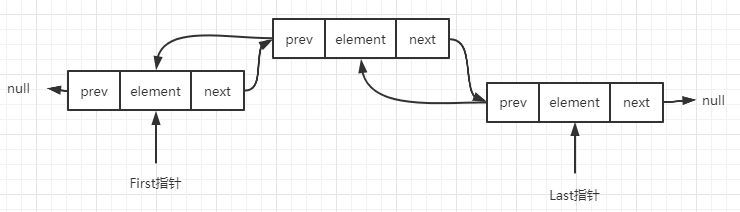
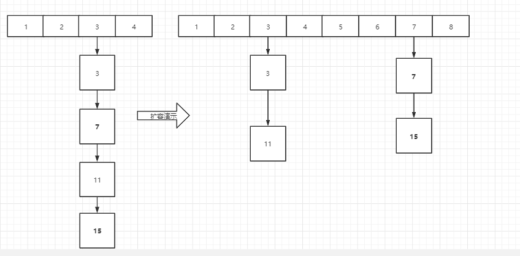

### List
#### ArrayList
##### 基础
* 底层实现：数组
* 是否线程安全：否
* 默认容量：10
```
public ArrayList(Collection<? extends E> c) {
// 这里调用的是数组的复制，数组的复制有用调用虚拟机通过System.arraycopy来复制的，
// 通过虚拟机(C语言)实现的复制，而得java代码
    Arrays.copyOf(elementData, size, Object[].class);
}
```
* 这里有一个有意义的属性，modCount，这个属性是给iterator和listIterator使用的，如果这个字段被意外的改动，就会出现我们常见的ConcurrentModificationExceptions，
所以在迭代的时候如果有添加或删除元素，就会有这个异常。只有add和remove的时候才会修改这个值
* ArrayList的最大的长度private static final int MAX_ARRAY_SIZE = Integer.MAX_VALUE - 8; 这里为什么是减8，是因为这句话`Some VMs reserve some header words in an array.`，
翻译过来就是`一些vm在一个数组中保留一些标题词`
##### 扩容
* 扩容（add和addAll每次都需要去判断是否需要扩容）
  * 扩容是每次增加当前数组的50%
  * 扩容会产生数组的复制，所以如果预知list比较大的话，可以选初始化一个大小
  * 扩容大小如果大于最大大小，就用最大大小（hugeCapacity）
  * 如果扩容小于0，就会抛出异常OutOfMemoryError
* 很多地方会用到这个来检查索引溢出：Objects.checkIndex(index, size)
##### 方法
* 有趣的方法：private void add(E e, Object[] elementData, int s)，目的是：这个helper方法从add(E)中分离出来，以将方法字节码大小保持在35 (-XX:MaxInlineSize默认值)以下，这有助于在c1编译的循环中调用add(E)。、
* add(index, element)方法的实现就是将index之后的数据向后面移动，这里的移动就是采用的数组的复制，然后再给index位赋值
* remove(element)方法的实现也是需要移动数据的
* addAll(list)发生一次复制，addAll(index, list)可能会发生两次复制
* Iterator提供了一个方法forEachRemaining，这个方法可以是我们的循环变得简单，不用再去写while了，其内部也是一个for循环。但是记住*这个不能做对Iterator修改的动作，否则会看到代码没有被执行的现象*
* ListIterator提供向后和向前遍历，但是要注意顺序，向前遍历是要游标指向最后一个向前遍历
* subList()方法其实返回的是一个内部类SubList类，这个类又重新重写了AbstractList中的所有的方法。在更新的时候也会同时跟新ArrayList类，所以subList回来的东西和ArrayList不是同一个，
这也是为什么阿里巴巴要求谨慎使用sublist方法，因为返回的就是SubList类，且不可以强转为ArrayList，它相当于是ArrayList的一个视图，所有对它的操作最终都会反映到原List中操作。
所以在对SubList出来的list执行add时，是在原list中不断的添加，如果数据过大，可能会有内存溢出的风险，所以可以考虑使用new一个list出来，`new ArrayList<>(list.subList(0, 20));`
#### LinkedList
##### 基础
* 实现原理：双向链表（里面有一个内部类Node）
* 允许存入null
 
* 是否线程安全：否
* first：每次都是从链表的头部开始插入
* last：每次都是从链表的尾部开始插入
##### 方法
* addAll()：这里的核心就是：1)原来的集合转成数组toArray，然后link一次；2)向后插入
* clear()： 这里的设计师为了GC的回收，将link拆解，就是每个节点谁也不再指向谁
* node(int index)：这是一个相当重要的方法，用于定位节点
#### Vector(线程安全版的ArrayList)
##### 基础
* 实现原理：数组
* 是否线程安全：是
* 默认容量：10
* 与ArrayList的不同点
  * 可以设置增长因子，即每次扩容多少可以在初始化的时候设置
  * 如果没有设置增长因子，在扩容的时候，是将之前的容量扩展一倍
#### Stack（继承Vector，然后提供了一些栈的方法）

### Set
#### HashSet
##### 基础
* 底层实现：HashMap

#### HashMap
##### 底层原理
* 数组加链表或者是数组加红黑树
##### 描述
* 哈希表基于Map接口的实现。此实现提供了所有可选的映射操作，并且允许键为null，值也为null。HashMap 除了不支持同步操作以及支持null的键值外，其功能大致等同于 Hashtable。这个类不保证元素的顺序，并且也不保证随着时间的推移，元素的顺序不会改变。
* 假设散列函数使得元素在哈希桶中分布均匀，那么这个实现对于 put 和 get 等操作提供了常数时间的性能。
* 对于一个 HashMap 的实例，有两个因子影响着其性能：初始容量和负载因子。容量就是哈希表中哈希桶的个数，初始容量就是哈希表被初次创建时的容量大小。负载因子是在进行自动扩容之前衡量哈希表存储键值对的一个指标。当哈希表中的键值对超过capacity * loadfactor时，就会进行 resize 的操作。
  * 作为一般规则，默认负载因子（0.75）在时间和空间成本之间提供了良好的折衷。负载因子越大，空间开销越小，但是查找的开销变大了。
* 注意，迭代器的快速失败行为不能得到保证，一般来说，存在非同步的并发修改时，不可能作出任何坚决的保证。快速失败迭代器尽最大努力抛出ConcurrentModificationException异常。因此，编写依赖于此异常的程序的做法是错误的，正确做法是：迭代器的快速失败行为应该仅用于检测程序错误。
##### 为什么要用2的幂次方
* HashMap中指定的哈希桶数组table.length必须是2的幂次方，这与常规性的把哈希桶数组设计为素数不一样。指定为2的幂次方主要是在两方面做优化：
  * 扩容：扩容的时候，哈希桶扩大为当前的两倍，因此只需要进行左移操作
  * 取模：由于哈希桶的个数为2的幂次，因此可以用&操作来替代耗时的模运算， n % table.length -> n & (table.length - 1)
##### hashMap resize方法图演示，扩容后重新排列链表
 
###### keySet()与entrySet()对比:
* keySet()：返回的是只存放key值的Set集合，使用迭代器方式遍历该Set集合，在迭代器中再使用get方法获取每一个键对应的值。使用get方法获取键对应的值时就需要遍历Map集合，主要的差异就在此处。
* entrySet()(效率高)：返回的是存放了映射关系的Set集合（一个映射关系就是一个键-值对），就是把(key-value)作为一个整体一对一对地存放到Set集合当中的。然后使用迭代器方式遍历该Set集合就可以取出Map中存放的键值对。


